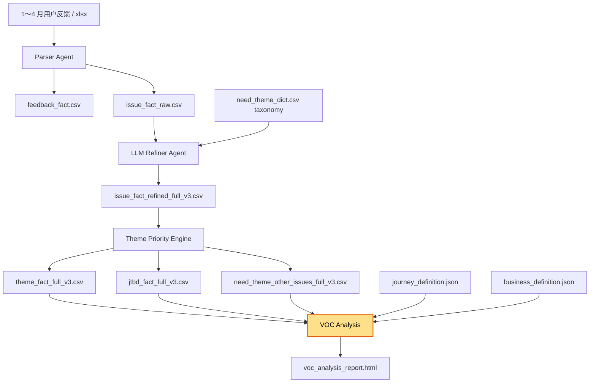

# VOC Agent

VOC（Voice of Customer）反馈分析系统。将原始用户反馈经解析、分类、聚合，输出结构化主题报表。



## 文件清单

| 文件 | 说明 |
|------|------|
| `1～4 月用户反馈/` | 原始 Excel（4 个） |
| `parser_agent.py` | 解析 Excel → feedback_fact + issue_fact_raw |
| `llm_refiner_agent.py` | LLM 精标：补全 is_voc / domain / need_theme_l2 等；SQLite 缓存、断点续跑、并发标注、关键词兜底 |
| `theme_priority_engine.py` | 聚合 issue → theme_fact / jtbd_fact / other 明细 |
| `voc_analysis.py` | 报告生成：阶段展开 / TOP 10 优先级 / 分车型统计 / Journey 图 / 业务部门深潜；支持 text + HTML 双输出 |
| `journey_definition.json` | JTBD 分类框架定义（lifecycle → jtbd → scenario → need_theme） |
| `business_definition.json` | 业务部门关注主题定义，用于 `--business` 深潜报告 |
| `need_theme_dict.csv` | 产品语言词典（主题 + 关键词 + jtbd/scenario 映射） |
| `.llm_refiner_cache.sqlite` | Refiner 自动生成的 LLM 调用缓存（自动管理） |
| `issue_fact_raw.csv` | Parser 输出（2722 issues） |
| `feedback_fact.csv` | Parser 中间产物 |
| `issue_fact_refined_full_v3.csv` | Refiner 精标完成（other ≈ **6.1%**） |
| `theme_fact_full_v3.csv` | 主题聚合表（按 need_theme_l1 + need_theme_l2 聚合） |
| `jtbd_fact_full_v3.csv` | JTBD 聚合表（按 jtbd_l1 + scenario_l2 聚合） |
| `need_theme_other_issues_full_v3.csv` | 未分类明细（165 条待消化） |

## 全量运行

```bash
. .venv/bin/activate

# 1) Parser
python parser_agent.py --input-dir '1～4 月用户反馈' \
  --output-feedback feedback_fact.csv \
  --output-issue issue_fact_raw.csv

# 2) Refiner（全量 sample-size=0，并发 5，带缓存）
python llm_refiner_agent.py --input issue_fact_raw.csv \
  --output issue_fact_refined_full.csv \
  --sample-size 0 \
  --taxonomy need_theme_dict.csv \
  --concurrency 5 \
  --resume

# 3) Theme Priority
python theme_priority_engine.py --input issue_fact_refined_full.csv \
  --output-theme theme_fact_full.csv \
  --output-jtbd jtbd_fact_full.csv \
  --output-other need_theme_other_issues_full.csv

# 4) Analysis Report（HTML + 终端双输出）
python voc_analysis.py \
  --theme theme_fact_full.csv \
  --jtbd jtbd_fact_full.csv \
  --source issue_fact_refined_full.csv \
  --definition journey_definition.json \
  --business business_definition.json \
  --other need_theme_other_issues_full.csv \
  --output voc_analysis_report.html
```

## LLM Refiner 高级参数

| 参数 | 默认值 | 说明 |
|------|--------|------|
| `--concurrency` | `5` | 并发线程数 |
| `--resume` | off | 从已有输出文件断点续跑（跳过已处理 feedback_id + issue_no） |
| `--cache-path` | `.llm_refiner_cache.sqlite` | SQLite 缓存路径 |
| `--no-cache` | off | 禁用 LLM 响应缓存 |
| `--allow-new-theme` | off | 允许 LLM 输出 `新主题候选:XXXX` |
| `--save-every` | `20` | 每 N 条写入一次 CSV |
| `--model` | `deepseek-v4-flash` | 模型名称 |
| `--base-url` | `https://api.deepseek.com` | API 地址 |
| `--max-tokens` | `512` | 单次最大 token 数 |
| `--temperature` | `0.0` | 采样温度 |
| `--sleep-s` | `0.1` | 每次 LLM 调用后休眠秒数（限速） |
| `--max-retries` | `6` | 失败重试次数 |

未分类记录会自动走**关键词兜底**匹配（`_match_taxonomy_by_keywords`），命中则覆盖 LLM 的"其他"输出。

## 只重跑 Other 子集

```bash
# 用新 dict 重跑未分类记录（--resume 支持断点续跑）
python llm_refiner_agent.py \
  --input need_theme_other_issues_full_v3.csv \
  --output other_refined.csv \
  --taxonomy need_theme_dict.csv \
  --sample-size 0 \
  --allow-new-theme \
  --resume

# merge 回主表
python -c "
import pandas as pd
v3 = pd.read_csv('issue_fact_refined_full_v3.csv', encoding='utf-8-sig', dtype='object')
other = pd.read_csv('other_refined.csv', encoding='utf-8-sig', dtype='object')
update_cols = ['need_theme_l1','need_theme_l2','need_theme','jtbd_l1','scenario_l2','is_voc']
m = v3.merge(other[['feedback_id','issue_no']+update_cols], on=['feedback_id','issue_no'], how='left', suffixes=('','_n'))
for c in update_cols: m[c] = m[f'{c}_n'].fillna(m[c]); m.drop(columns=[f'{c}_n'], inplace=True)
m.to_csv('issue_fact_refined_full_v4.csv', index=False, encoding='utf-8-sig')
"
```

## voc_analysis.py 参数

| 参数 | 默认值 | 说明 |
|------|--------|------|
| `--definition` | `journey_definition.json` | 用户旅程定义（lifecycle → jtbd → scenario 层次结构） |
| `--business` | `business_definition.json` | 业务部门关注主题定义（仅在文件存在时启用深潜报告） |
| `--no-html` | off | 仅终端输出，不生成 HTML |
| `--output` | `voc_analysis_report.html` | HTML 报告输出路径 |

报告包含：TOP 10 优先级、阶段分布、JTBD 深度展开、分车型统计、用户旅程图（Mermaid）、未分类明细；若提供 `--business` 则附加部门级全量明细表。

## 当前状态

- **全量 issues**: 2722 条
- **other 率**: **6.1%**（目标 <5%）
- **主题数**: 83 个（L1: 智驾/智舱/服务/交付/车辆品质/补能 等）
- **JTBD 数**: 12 个（场景维度）
- **按优先级排序**: theme_fact_full_v3.csv 按 priority_score 降序

## 产品语言词典维护

`need_theme_dict.csv` 结构：

| 字段 | 说明 |
|------|------|
| need_theme_l1 | L1 分类（如智驾体验、服务体验） |
| need_theme_l2 | L2 主题（如自动泊车体验） |
| jtbd_l1 | 用户任务（如智驾、停车）；LLM Refiner 据此自动映射 |
| scenario_l2 | 场景（如 NOA、自动泊车）；LLM Refiner 据此自动映射 |
| keywords | 逗号分隔的关键词，用于 LLM 分类匹配及关键词兜底 |
