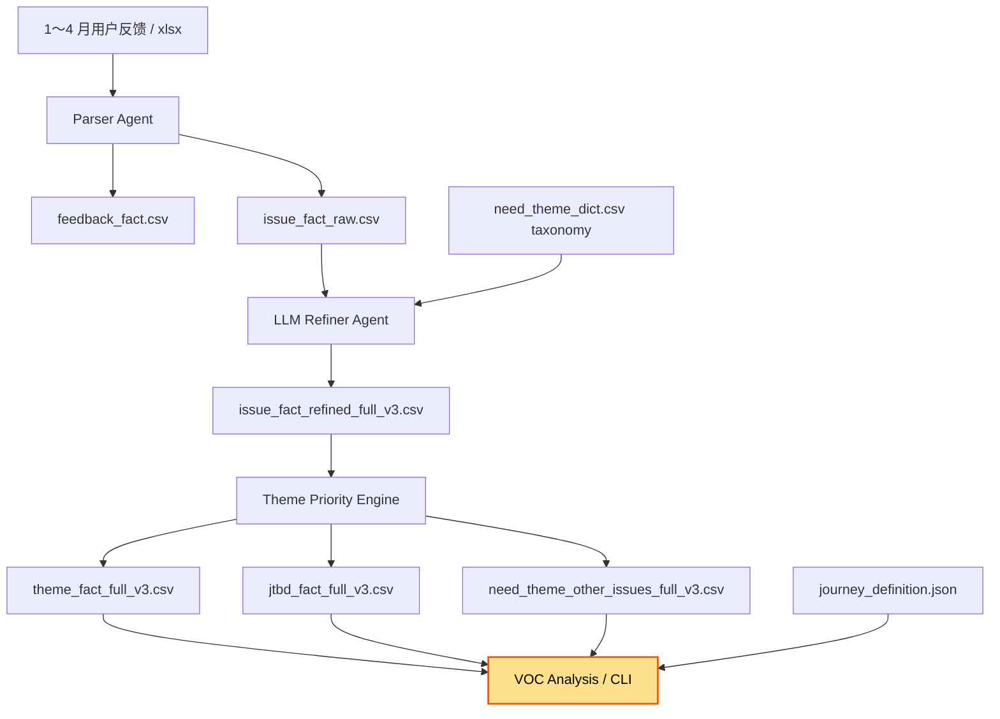

# VOC Agent

VOC（Voice of Customer）反馈分析系统。将原始用户反馈经解析、分类、聚合，输出结构化主题报表。



## 文件清单

| 文件 | 说明 |
|------|------|
| `1～4 月用户反馈/` | 原始 Excel（4 个） |
| `parser_agent.py` | 解析 Excel → feedback_fact + issue_fact_raw |
| `llm_refiner_agent.py` | LLM 精标：补全 is_voc / domain / need_theme_l2 等 |
| `theme_priority_engine.py` | 聚合 issue → theme_fact / jtbd_fact / other 明细 |
| `voc_analysis.py` | 报告生成脚本：阶段展开 / TOP 10 优先级 / 未分类明细 |
| `journey_definition.json` | JTBD 分类框架定义（jtbd_scenarios + need_theme_dict） |
| `classification_framework.md` | 分类框架文档 |
| `need_theme_dict.csv` | 产品语言词典（63 个主题 + 关键词） |
| `issue_fact_raw.csv` | Parser 输出（2722 issues） |
| `feedback_fact.csv` | Parser 中间产物 |
| `issue_fact_refined_full_v3.csv` | Refiner 精标完成（other ≈ **6.1%**） |
| `theme_fact_full_v3.csv` | 主题聚合表（按 need_theme_l1 + need_theme_l2 聚合） |
| `jtbd_fact_full_v3.csv` | JTBD 聚合表（按 jtbd_l1 + scenario_l2 聚合） |
| `need_theme_other_issues_full_v3.csv` | 未分类明细（165 条待消化） |

## 全量运行

```bash
. .venv/bin/activate

# 1) Parser
python parser_agent.py --input-dir '1～4 月用户反馈' \
  --output-feedback feedback_fact.csv \
  --output-issue issue_fact_raw.csv

# 2) Refiner（全量 sample-size=0）
python llm_refiner_agent.py --input issue_fact_raw.csv \
  --output issue_fact_refined_full.csv \
  --sample-size 0 \
  --taxonomy need_theme_dict.csv

# 3) Theme Priority
python theme_priority_engine.py --input issue_fact_refined_full.csv \
  --output-theme theme_fact_full.csv \
  --output-jtbd jtbd_fact_full.csv \
  --output-other need_theme_other_issues_full.csv

# 4) Analysis Report
python voc_analysis.py \
  --theme theme_fact_full.csv \
  --jtbd jtbd_fact_full.csv \
  --source issue_fact_refined_full.csv \
  --other need_theme_other_issues_full.csv \
  --output voc_analysis_report.html
```

## 只重跑 Other 子集

```bash
# 用新 dict 重跑未分类记录
python llm_refiner_agent.py \
  --input need_theme_other_issues_full_v3.csv \
  --output other_refined.csv \
  --taxonomy need_theme_dict.csv \
  --sample-size 0 \
  --allow-new-theme

# merge 回主表
python -c "
import pandas as pd
v3 = pd.read_csv('issue_fact_refined_full_v3.csv', encoding='utf-8-sig', dtype='object')
other = pd.read_csv('other_refined.csv', encoding='utf-8-sig', dtype='object')
update_cols = ['need_theme_l1','need_theme_l2','need_theme','jtbd_l1','scenario_l2','is_voc']
m = v3.merge(other[['feedback_id','issue_no']+update_cols], on=['feedback_id','issue_no'], how='left', suffixes=('','_n'))
for c in update_cols: m[c] = m[f'{c}_n'].fillna(m[c]); m.drop(columns=[f'{c}_n'], inplace=True)
m.to_csv('issue_fact_refined_full_v4.csv', index=False, encoding='utf-8-sig')
"
```

## 当前状态

- **全量 issues**: 2722 条
- **other 率**: **6.1%**（目标 <5%）
- **主题数**: 83 个（L1: 智驾/智舱/服务/交付/车辆品质/补能 等）
- **JTBD 数**: 12 个（场景维度）
- **按优先级排序**: theme_fact_full_v3.csv 按 priority_score 降序

## 产品语言词典维护

`need_theme_dict.csv` 结构：

| 字段 | 说明 |
|------|------|
| need_theme_l1 | L1 分类（如智驾体验、服务体验） |
| need_theme_l2 | L2 主题（如自动泊车体验） |
| jtbd_l1 | 用户任务（如智驾、停车） |
| scenario_l2 | 场景（如 NOA、自动泊车） |
| keywords | 逗号分隔的关键词，用于 LLM 分类匹配 |
